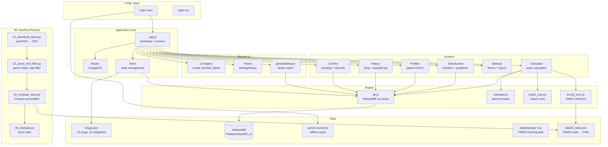
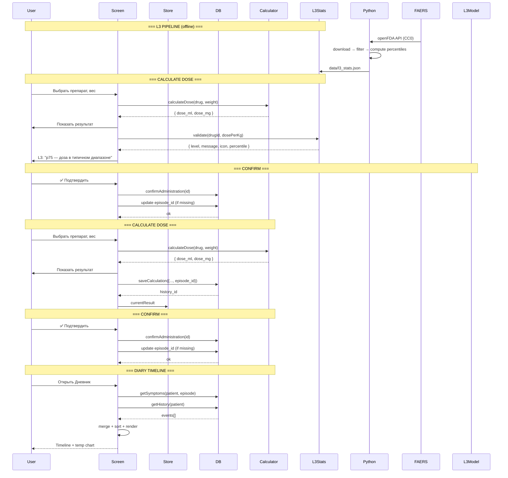
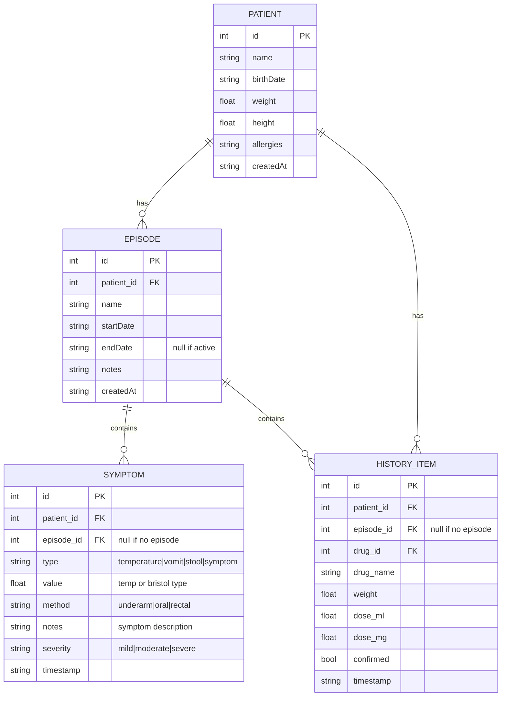
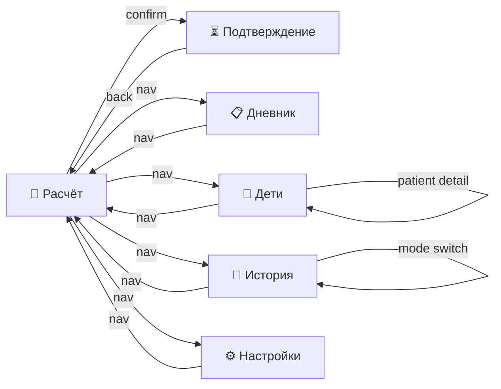

# AGENTS.md — Pediatric Dose Calculator (PWA)

## Project Management

- **Project Board:** https://github.com/users/TestingInPractice/projects/4/views/1
- **Issues:** https://github.com/TestingInPractice/pediatric-dose-pwa/issues
- **After completing a task:**
  1. Run tests: `npm run test`
  2. Commit changes: `git add . && git commit -m "<message>"`
  3. Move issue to "Done" on project board: `gh project item-edit --id <item-id> --field Status --value Done`
  4. Close issue: `gh issue close <number> --repo TestingInPractice/pediatric-dose-pwa --comment "<summary>"`

---

## Architecture Workflow

Every feature goes through: **Spec → Diagram → Model → Implementation → Review**

```
┌────────────────────────────────────────────────────────┐
│ 1. SPECIFICATION                                       │
│    Define: what, why, constraints, edge cases           │
│    Output: short spec in issue / AGENTS.md section      │
├────────────────────────────────────────────────────────┤
│ 2. ARCHITECTURE DIAGRAM                                 │
│    Draw: component diagram, data flow, screen flow      │
│    Output: mermaid diagram in AGENTS.md                  │
├────────────────────────────────────────────────────────┤
│ 3. DATA MODEL                                           │
│    Define: entities, fields, types, relationships, DB   │
│    Output: entity schema in AGENTS.md                   │
├────────────────────────────────────────────────────────┤
│ 4. IMPLEMENTATION                                       │
│    Code: per module boundary, each < 200 lines          │
│    Test: unit + integration                             │
├────────────────────────────────────────────────────────┤
│ 5. REVIEW                                               │
│    Check: data flow, error states, offline, dark mode   │
│    Update AGENTS.md with lessons learned                │
└────────────────────────────────────────────────────────┘
```

---

## Architecture Diagrams

### Component Diagram



### Data Flow



### Data Model



### Screen Navigation



---

## Module Boundaries

| Module | File | Lines | Responsibility |
|--------|------|-------|----------------|
| Store | `js/store.js` | ~80 | State + data loading |
| UI | `js/ui.js` | ~120 | Modal, theme, formats, labels |
| Diary | `js/diary.js` | ~430 | Diary screen, episodes, symptoms, timeline, chart |
| Report | `js/report.js` | ~110 | Doctor report generation |
| App | `js/app.js` | ~500 | Bootstrap, router, calculator, profiles, history, settings |
| Calculator | `js/calculator.js` | 87 | Dose formula engine |
| DB | `js/db.js` | 220 | IndexedDB CRUD (Dexie) |
| Rules | `js/level2_rules.js` | — | Expert system L2 |
| L3 Stats | `js/level3_onnx.js` | ~90 | Percentile-based dose validation via FAERS stats |

**Rules:**
- Each module < 200 lines (app.js is larger but acts as orchestrator)
- No circular dependencies: Store → DB, Diary → Store+DB+UI, App → all
- Shared state only through Store, never globals
- DOM queries only through `$()` / `qsa()` (defined in store.js)

---

## L3 Pipeline (FAERS → Stats JSON)

L3 использует реальные данные из FAERS (FDA Adverse Event Reporting System) — открытая база CC0, без регистрации. Вместо ML-модели (слишком мало педиатрических данных с весом — ~400 строк) используется статистический подход: для каждого активного ингредиента вычисляются перцентили доз (p5, p25, p50, p75, p95). L3-модуль в PWA сравнивает назначенную дозу с этими перцентилями.

### Pipeline шаги

```bash
pip install -r model/requirements.txt

# 1. Скачать FAERS данные для всех 16 препаратов
python model/01_download_faers.py

# 2. Распарсить дозы, отфильтровать 0-18 лет
python model/02_parse_and_filter.py

# 3. Вычислить перцентили → data/l3_stats.json
python model/03_compute_stats.py

# 4. Оценить результаты
python model/05_evaluate.py
```

### Output: `data/l3_stats.json`

```json
{
  "version": "1.0.0",
  "source": "FAERS (openFDA)",
  "by_generic": {
    "paracetamol": {
      "count": 17,
      "dose_mg_per_kg": {
        "n": 17, "mean": 9.77, "p50": 10.00,
        "p5": 0.43, "p95": 19.01
      }
    },
    "ibuprofen": {
      "count": 42,
      "dose_mg_per_kg": {
        "n": 42, "mean": 8.87, "p50": 7.80,
        "p5": 0.38, "p95": 13.64
      }
    }
  }
}
```

### Data source

- **FAERS** (openFDA API): CC0, без регистрации
- **668k** отчётов по парацетамолу, **279k** по ибупрофену
- **402** педиатрических записей после фильтрации (возраст 0-18, вес 1-200 кг, доза ≤100 мг/кг)
- Данные сохраняются в `data/training/*.csv` и `data/l3_stats.json` (версионируются в git)

## Developer Commands

```bash
# Запустить локальный сервер для разработки
npx serve .

# Запустить тесты
npm run test

# FAERS pipeline (требуется Python 3.10+)
pip install -r model/requirements.txt
python model/01_download_faers.py
python model/02_parse_and_filter.py
python model/03_compute_stats.py
python model/05_evaluate.py

# Открыть в браузере
open http://localhost:3000
```

## Key Constraints

- **Zero backend** — всё работает в браузере, никаких серверов
- **Офлайн first** — полная функциональность без интернета
- **HTTPS обязателен** для Service Worker на iOS
- **Каждый модуль < 200 строк** — иначе декомпозировать
- **Все изменения через Store** — никаких мутаций на лету

## Directory Layout

```
pediatric-dose-pwa/
├── index.html                  ← SPA entry
├── manifest.json               ← PWA config
├── service-worker.js           ← кэш + офлайн
├── css/
│   └── style.css               ← mobile-first
├── js/
│   ├── store.js                ← состояние + загрузка данных
│   ├── ui.js                   ← модалка, тема, форматеры
│   ├── diary.js                ← дневник, эпизоды, симптомы
│   ├── report.js               ← доктор-репорт
│   ├── app.js                  ← bootstrap, роутер, экраны
│   ├── calculator.js           ← расчёт доз
│   ├── db.js                   ← IndexedDB (Dexie.js)
│   ├── level2_rules.js         ← экспертная система
│   ├── level3_onnx.js          ← ML-модель
│   ├── level4_images.js        ← скриншоты инструкций
│   └── updater.js              ← проверка/скачивание обновлений
├── data/
│   ├── manifest.json
│   ├── drugs.json              ← 16 препаратов, 10 категорий
│   ├── images/                 ← L4 скриншоты инструкций (PNG)
│   └── training/               ← FAERS training data (CSV, в git)
├── model/
│   ├── requirements.txt        ← Python deps (pandas, xgboost, onnx)
│   ├── 01_download_faers.py    ← Download FAERS via openFDA API
│   ├── 02_parse_and_filter.py  ← Parse doses, filter pediatric
│   ├── 03_compute_stats.py     ← Compute percentiles per generic
│   └── 05_evaluate.py          ← Show stats by drug/generic
├── icons/
│   ├── icon-192x192.png
│   └── icon-512x512.png
├── tests/
│   └── calculator.test.js      ← 22 тестов
└── AGENTS.md
```
